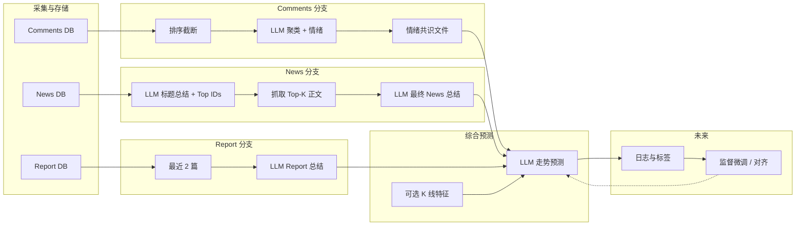
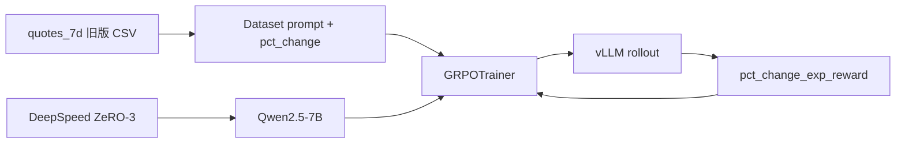

# MarketMind 项目架构（规划）

本文描述数据采集与舆情分析管线的设计目标与阶段划分，便于后续实现时对齐模块边界与数据流。

---

## 1. 总体目标

围绕单只股票、某一交易日（或分析日），整合三类信息源：

| 来源 | 含义 |
|------|------|
| **Comments** | 论坛/股吧等用户讨论 |
| **News** | 当日新闻标题与正文 |
| **Report** | 卖方/机构研报 |

在分别得到三类**结构化总结**后，再调用大模型做**未来股价走向**的综合判断。行情侧预测任务已从「对精确涨跌幅做 GRPO 回归」调整为「**涨跌二分类**」监督（见 §10），因回归式 RL 在本数据上难以稳定训练。

---

## 2. Comments：从原始讨论到「情绪共识」

### 2.1 数据形态

- 原始数据：多条帖子/评论，通常带标题、时间、互动量（点击、回复数）等。
- 入库后按股票代码、日期筛选当日记录。

### 2.2 汇总为情绪共识的流程（概念）

1. **排序与截断**：按互动量（点击、评论数等）对帖子加权，优先保留高曝光内容，控制送入模型的条数上限。
2. **聚类式总结**：调用 LLM，要求输出固定结构的 JSON，例如：
   - **观点簇（clusters）**：2～3 个主题簇，每簇含简要 summary、情绪强度、簇内共识程度等标量。
   - **全局情绪分布**：正面 / 中性 / 负面比例（或概率），用于表征当日讨论对股价的「共识情绪」。
3. **落盘为「情绪共识文件」**：将上述 JSON（及可选元数据：股票、日期、原始条数、模型版本）写入约定路径或数据库表，作为下游「综合预测」模块的 **Comments 侧输入**。

当前 `stock_daily_dashboard.py` 中的流式总结即该链路的前端形态；未来可将同样 prompt 与 schema 固化到批处理脚本，并统一输出文件名或表结构。

---

## 3. News：两阶段总结 + 正文增强

### 3.1 第一阶段（与现状对齐）

- 输入：当日新闻**标题列表**（每条带稳定 **news_id**）。
- 输出：
  - 与 Comments 类似的主题簇与全局情绪结构；
  - **`top_future_relevant_news_ids`**：与未来走向最相关的若干条 id（例如最多 10 条，不足则全列）。

### 3.2 第二阶段（规划中）

1. 根据 id **拉取对应新闻正文**（HTTP 抓取或已有正文字段）。
2. 将以下内容一并送入 LLM：
   - 第一阶段的**标题级总结**（JSON 或摘要文本）；
   - **Top-K 新闻的全文或截断正文**（控制 token，必要时分段摘要）。
3. 要求模型输出 **最终 News 总结**（可仍为 JSON 或更偏叙述的结构），强调与**未来走势**相关的因果与不确定性。

该阶段解决「标题信息不足」的问题，使 News 分支与 Report、Comments 的信息密度在同一量级。

---

## 4. Report：历史研报摘要

- **选取规则**：当前分析日 **之前** 的最近 **2 篇** 研报（按发布日期倒序）。
- **处理**：将标题、摘要、若有关键段落或全文（视抓取能力）送入 LLM，生成 **Report 总结**（观点、评级/目标价倾向、核心逻辑、风险提示等）。

输出同样作为综合预测模块的 **Report 侧输入**。

---

## 5. 综合预测：三源合一

在固定分析日下，准备三块输入：

1. **Comments 情绪共识**（文件或结构化记录）
2. **News 最终总结**（二阶段产物）
3. **Report 总结**（近 2 篇）

再调用 **单一 LLM 会话**（或多步 agent，视产品需求）：

- 显式要求模型综合三方信息，给出**未来走势判断**（方向、时间尺度如 1/3/7 日、置信度、主要依据与冲突点）。
- 可选：叠加 **K 线等行情特征**（与现有 dashboard 中预测思路一致），作为第四类输入。

---

## 6. 模型迭代与监督信号（规划）

「让模型给出更好结果」在工程上可拆为：

- **数据**：保留 `(输入快照, 模型输出, 后续真实走势标签或人工评分)`，形成训练或对齐用的样本。
- **方法（概念选型）**：
  - **监督微调 / 分类**：当前行情预测以 **涨/跌** 标签为主（见 §9、`build_quotes_7d_dataset.py`），目标更稳定、可评估。
  - **基于人类反馈的微调（RLHF/DPO 等）**：可用于总结类任务的可读性与校准；**不推荐**在「精确预测涨跌幅数值」上继续用 GRPO 式稀疏奖励（原因见 §10）。
  - 若使用与预测误差相关的奖励，需注意过拟合与分布外风险。

实施顺序建议：先跑通**可复现的批处理管线 + 统一 schema**，再小规模收集反馈或标签；**行情数值回归 + GRPO** 已在实验中弃用（§10）。

---

## 7. 模块关系（简图）

---

## 8. 与现有代码的对应关系（便于落地）

| 能力 | 现状 / 备注 |
|------|-------------|
| Comments 流式总结 | `stock_daily_dashboard.py` → `/summarize_stream` |
| News 标题总结 + Top ids | 同文件 → `/summarize_news_stream` |
| News 正文二阶段、Report 近 2 篇、统一预测 | 待实现：可拆为独立脚本或服务，与 dashboard 共用 prompt 与 schema |
| Quotes → 涨跌分类数据集 | `scripts/build_quotes_7d_dataset.py` → `train/dataset/quotes_7d_pre2026_dataset.csv`（`prompt` + `label` 涨/跌）；见 §9 |
| （历史）Quotes → GRPO 涨跌幅回归 | 仓库仍保留 `train/scripts/grpo/train_grpo_qwen.py` 等，**不作为当前推荐路径**；见 §10 |

---

## 9. Quotes 七日 K 线 prompt 数据集（`build_quotes_7d_dataset.py`）

从 **`exports/quotes.csv`** 生成**单一** UTF-8 CSV，列 **`prompt`, `label`**：

- **`prompt`**：中文说明 + 连续 7 个交易日（Day1…Day7）的归一化 K 线描述 + 任务尾段，要求模型**只输出**下一交易日（Day8）的 **「涨」或「跌」**。
- **`label`**：Day8 当日真实方向——`pct_change >= 0` 为 **「涨」**，否则为 **「跌」**；缺 `pct_change` 的样本丢弃。

从 `exports/quotes.csv` 读取 **`trade_date < train_before`**（默认 `2026-01-01`），以保证标签窗口起点（默认 `2021-01-01`）之前的 **7 个交易日** 可作特征。**仅输出**标签日满足 **`date_start <= trade_date < train_before`** 的样本（默认 **2021-01-01 ≤ Day8 < 2026-01-01**）。不再划分验证集。默认输出：`train/dataset/quotes_7d_pre2026_dataset.csv`（可用 `-o` 指定）。

### 9.1 数据筛选与滑动窗口

1. **读取**：保留 `trade_date < train_before` 的行，按 `symbol`、`trade_date` 升序。
2. **按股票分组**：每个 `symbol` 一条时间序列；日历非交易日自然跳过，只保留**顺序上的相邻交易日**。
3. **样本**：对长度为 `n` 的序列，每个索引 `k ∈ [7, n-1]`，且 **`date_start <= trade_date(k) < train_before`**：
   - **特征窗口**：第 `k-7` … `k-1` 共 7 根 K 线 → Day1 … Day7（可早于 `date_start`）。
   - **标签日**：第 `k` 根 K 线，对应 **Day8**；用其 `pct_change` 映射为 `label` ∈ {涨, 跌}。
4. **最短序列**：不足 8 根 K 线的股票不产生样本；在 `[date_start, train_before)` 内无行情的股票跳过。

### 9.2 每只股票内的归一化（仅在标签窗口内估计）

对**该股票**在 **`date_start <= trade_date < train_before`** 的行情行上计算一套标量统计量；**同一只股票的所有样本共用**这一统计量。若需严格 walk-forward，可改为仅用「标签日前一日及之前」的历史估计 scaler（当前实现未做）。

| 字段 | 规则 |
|------|------|
| `open` | 该股所有 `open` 的 min、max → Min-Max 到 `[0, 1]` |
| `high` | 该股所有 `high` 的 min、max → Min-Max 到 `[0, 1]` |
| `low` | 该股所有 `low` 的 min、max → Min-Max 到 `[0, 1]` |
| `close` | 该股所有 `close` 的 min、max → Min-Max 到 `[0, 1]` |
| `volume` | `ln(1 + volume)` 后，在该股所有 log 成交量上做 Min-Max 到 `[0, 1]` |
| `pct_change` | 该股所有 `pct_change` 的均值、总体标准差 → Z-score；标准差过小则夹为 `1.0` 避免除零 |
| `turnover` | 该股所有 `turnover` 的 min、max → Min-Max 到 `[0, 1]` |
| `amplitude` | **不归一化**，原样写入 prompt |

若某字段在全历史中无有效样本，对应 min/max 使用退化边界（避免除零）。

### 9.3 Prompt 拼装

1. 一段固定**中文说明**（简述上述归一化含义）。
2. 连续 7 行 `Day{i}: open=…, high=…, …`（数值为归一化或 Z-score 后的浮点字符串）。
3. 固定**任务尾段**：只预测下一交易日涨/跌，且**只输出一个字**「涨」或「跌」。

### 9.4 写出

- **格式**：UTF-8 CSV，表头 `prompt`, `label`；`prompt` 含换行，由 CSV 引号转义。
- **数据源**：`exports/quotes.csv`（无 PostgreSQL 依赖）。

---

## 10. 训练策略：为何不再采用「涨跌幅数值 + GRPO」

### 10.1 现象与结论

此前在 **同一类 7 日 K 线 prompt** 上，用 **GRPO** 对模型生成的 **下一日涨跌幅数值** 与标签 `pct_change` 做 **`exp(-|pred-label|/100)`** 式奖励时，训练曲线出现典型**失效形态**，见 **`docs/reward_loss_vs_step.png`**（训练曲线，来自完整 `output.log`）：

- **Mean reward**：在约 0.75～0.95 之间**剧烈波动**，无明显上升或收敛，更像噪声而非策略改进。
- **Loss**：在约第 20 step 后**长时间恒为 0**（图中水平为 0 的线段）。

### 10.2 原因说明（与 GRPO 机制一致）

- **涨跌幅度（连续数值）**在噪声极大的日频行情上是一个**极难收敛的目标**；组内多条 completion 的 reward 往往接近，模型容易**退化为总是输出相近或固定的数值**。
- 一旦同组内各条输出的 reward **几乎相同**，**组内相对优势（Advantage）** 趋近于 **0**；策略梯度项消失，**有效 loss 为 0**，优化器**不再产生有意义的参数更新**，表现为「训练停滞」。
- 因此，**不再将「精确预测涨跌幅」作为当前主线的 RL 目标**；改为 §9 的 **涨/跌二分类** 标签，便于监督学习或分类损失，目标更明确、可评估。

### 10.3 历史 GRPO 实现（仓库仍保留，仅供参考）

以下描述 **旧版** `train/scripts/grpo/train_grpo_qwen.py` 等脚本的设计，**与当前推荐的 `prompt` + `label` 数据集不一致**；若需复现实验，需自行改数据列与 reward。

在旧版 **两列 `prompt`, `pct_change`** 的 CSV 上，对 **Qwen2.5-7B-Instruct** 做 **GRPO**（TRL `GRPOTrainer`），配合 **Accelerate + DeepSpeed ZeRO-3** 与 **vLLM rollout**。

| 路径 | 作用 |
|------|------|
| `train/scripts/grpo/train_grpo_qwen.py` | 读 `prompt` / `pct_change`，套 Qwen chat template，构造 `GRPOTrainer` |
| `train/scripts/launch/run_grpo_8gpu.sh` | 仓库根目录执行 `accelerate launch`（默认 8 进程） |
| `train/configs/accelerate/deepspeed_zero3.yaml` | `distributed_type: DEEPSPEED`，`num_processes: 8`，引用 `train/configs/deepspeed/zero3.json` |
| `train/configs/deepspeed/zero3.json` | ZeRO-3、`bf16` 等 |
| `train/requirements.txt` | 含 `trl[vllm]` |

**旧 reward（与实现对齐）**：从 completion 最后一行解析浮点预测，与 `pct_change` 算 `diff = |pred - label|`，`reward = exp(-(diff/100))`；解析失败则 reward = 0。

**vLLM 模式**：`colocate`（与训练同机）或 `server`（独立服务）；详见脚本与 TRL 文档。

---

*文档版本：规划说明，随实现迭代更新。*
