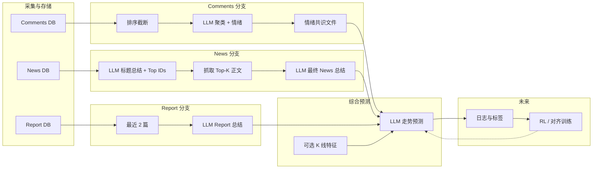

# MarketMind 项目架构（规划）

本文描述数据采集与舆情分析管线的设计目标与阶段划分，便于后续实现时对齐模块边界与数据流。

---

## 1. 总体目标

围绕单只股票、某一交易日（或分析日），整合三类信息源：

| 来源 | 含义 |
|------|------|
| **Comments** | 论坛/股吧等用户讨论 |
| **News** | 当日新闻标题与正文 |
| **Report** | 卖方/机构研报 |

在分别得到三类**结构化总结**后，再调用大模型做**未来股价走向**的综合判断；长期希望通过**强化学习（或与人类反馈结合的训练）**提升预测与总结质量。

---

## 2. Comments：从原始讨论到「情绪共识」

### 2.1 数据形态

- 原始数据：多条帖子/评论，通常带标题、时间、互动量（点击、回复数）等。
- 入库后按股票代码、日期筛选当日记录。

### 2.2 汇总为情绪共识的流程（概念）

1. **排序与截断**：按互动量（点击、评论数等）对帖子加权，优先保留高曝光内容，控制送入模型的条数上限。
2. **聚类式总结**：调用 LLM，要求输出固定结构的 JSON，例如：
   - **观点簇（clusters）**：2～3 个主题簇，每簇含简要 summary、情绪强度、簇内共识程度等标量。
   - **全局情绪分布**：正面 / 中性 / 负面比例（或概率），用于表征当日讨论对股价的「共识情绪」。
3. **落盘为「情绪共识文件」**：将上述 JSON（及可选元数据：股票、日期、原始条数、模型版本）写入约定路径或数据库表，作为下游「综合预测」模块的 **Comments 侧输入**。

当前 `stock_daily_dashboard.py` 中的流式总结即该链路的前端形态；未来可将同样 prompt 与 schema 固化到批处理脚本，并统一输出文件名或表结构。

---

## 3. News：两阶段总结 + 正文增强

### 3.1 第一阶段（与现状对齐）

- 输入：当日新闻**标题列表**（每条带稳定 **news_id**）。
- 输出：
  - 与 Comments 类似的主题簇与全局情绪结构；
  - **`top_future_relevant_news_ids`**：与未来走向最相关的若干条 id（例如最多 10 条，不足则全列）。

### 3.2 第二阶段（规划中）

1. 根据 id **拉取对应新闻正文**（HTTP 抓取或已有正文字段）。
2. 将以下内容一并送入 LLM：
   - 第一阶段的**标题级总结**（JSON 或摘要文本）；
   - **Top-K 新闻的全文或截断正文**（控制 token，必要时分段摘要）。
3. 要求模型输出 **最终 News 总结**（可仍为 JSON 或更偏叙述的结构），强调与**未来走势**相关的因果与不确定性。

该阶段解决「标题信息不足」的问题，使 News 分支与 Report、Comments 的信息密度在同一量级。

---

## 4. Report：历史研报摘要

- **选取规则**：当前分析日 **之前** 的最近 **2 篇** 研报（按发布日期倒序）。
- **处理**：将标题、摘要、若有关键段落或全文（视抓取能力）送入 LLM，生成 **Report 总结**（观点、评级/目标价倾向、核心逻辑、风险提示等）。

输出同样作为综合预测模块的 **Report 侧输入**。

---

## 5. 综合预测：三源合一

在固定分析日下，准备三块输入：

1. **Comments 情绪共识**（文件或结构化记录）
2. **News 最终总结**（二阶段产物）
3. **Report 总结**（近 2 篇）

再调用 **单一 LLM 会话**（或多步 agent，视产品需求）：

- 显式要求模型综合三方信息，给出**未来走势判断**（方向、时间尺度如 1/3/7 日、置信度、主要依据与冲突点）。
- 可选：叠加 **K 线等行情特征**（与现有 dashboard 中预测思路一致），作为第四类输入。

---

## 6. 强化学习与效果迭代（规划）

「让模型给出更好结果」在工程上可拆为：

- **数据**：保留 `(输入快照, 模型输出, 后续真实走势标签或人工评分)`，形成训练或对齐用的样本。
- **方法（概念选型）**：
  - **基于人类反馈的微调（RLHF/DPO 等）**：用排序或打分信号更新策略，使输出更符合投资可读性与校准度。
  - **或与预测误差相关的奖励**：在合规与可解释前提下，用事后收益/波动构造弱奖励信号（需注意过拟合与分布外风险）。

实施顺序建议：先跑通**可复现的批处理管线 + 统一 schema**，再小规模收集反馈或标签，最后再接 RL/对齐训练，避免在数据未闭环时过早训练。

---

## 7. 模块关系（简图）

---

## 8. 与现有代码的对应关系（便于落地）

| 能力 | 现状 / 备注 |
|------|-------------|
| Comments 流式总结 | `stock_daily_dashboard.py` → `/summarize_stream` |
| News 标题总结 + Top ids | 同文件 → `/summarize_news_stream` |
| News 正文二阶段、Report 近 2 篇、统一预测 | 待实现：可拆为独立脚本或服务，与 dashboard 共用 prompt 与 schema |

---

*文档版本：规划说明，随实现迭代更新。*
