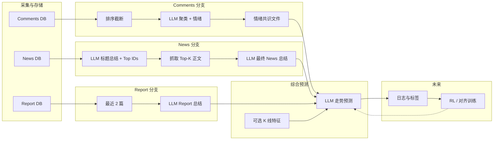
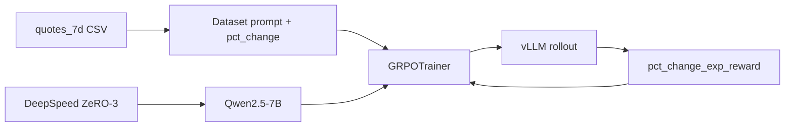

# MarketMind 项目架构（规划）

本文描述数据采集与舆情分析管线的设计目标与阶段划分，便于后续实现时对齐模块边界与数据流。

---

## 1. 总体目标

围绕单只股票、某一交易日（或分析日），整合三类信息源：

| 来源 | 含义 |
|------|------|
| **Comments** | 论坛/股吧等用户讨论 |
| **News** | 当日新闻标题与正文 |
| **Report** | 卖方/机构研报 |

在分别得到三类**结构化总结**后，再调用大模型做**未来股价走向**的综合判断；长期希望通过**强化学习（或与人类反馈结合的训练）**提升预测与总结质量。

---

## 2. Comments：从原始讨论到「情绪共识」

### 2.1 数据形态

- 原始数据：多条帖子/评论，通常带标题、时间、互动量（点击、回复数）等。
- 入库后按股票代码、日期筛选当日记录。

### 2.2 汇总为情绪共识的流程（概念）

1. **排序与截断**：按互动量（点击、评论数等）对帖子加权，优先保留高曝光内容，控制送入模型的条数上限。
2. **聚类式总结**：调用 LLM，要求输出固定结构的 JSON，例如：
   - **观点簇（clusters）**：2～3 个主题簇，每簇含简要 summary、情绪强度、簇内共识程度等标量。
   - **全局情绪分布**：正面 / 中性 / 负面比例（或概率），用于表征当日讨论对股价的「共识情绪」。
3. **落盘为「情绪共识文件」**：将上述 JSON（及可选元数据：股票、日期、原始条数、模型版本）写入约定路径或数据库表，作为下游「综合预测」模块的 **Comments 侧输入**。

当前 `stock_daily_dashboard.py` 中的流式总结即该链路的前端形态；未来可将同样 prompt 与 schema 固化到批处理脚本，并统一输出文件名或表结构。

---

## 3. News：两阶段总结 + 正文增强

### 3.1 第一阶段（与现状对齐）

- 输入：当日新闻**标题列表**（每条带稳定 **news_id**）。
- 输出：
  - 与 Comments 类似的主题簇与全局情绪结构；
  - **`top_future_relevant_news_ids`**：与未来走向最相关的若干条 id（例如最多 10 条，不足则全列）。

### 3.2 第二阶段（规划中）

1. 根据 id **拉取对应新闻正文**（HTTP 抓取或已有正文字段）。
2. 将以下内容一并送入 LLM：
   - 第一阶段的**标题级总结**（JSON 或摘要文本）；
   - **Top-K 新闻的全文或截断正文**（控制 token，必要时分段摘要）。
3. 要求模型输出 **最终 News 总结**（可仍为 JSON 或更偏叙述的结构），强调与**未来走势**相关的因果与不确定性。

该阶段解决「标题信息不足」的问题，使 News 分支与 Report、Comments 的信息密度在同一量级。

---

## 4. Report：历史研报摘要

- **选取规则**：当前分析日 **之前** 的最近 **2 篇** 研报（按发布日期倒序）。
- **处理**：将标题、摘要、若有关键段落或全文（视抓取能力）送入 LLM，生成 **Report 总结**（观点、评级/目标价倾向、核心逻辑、风险提示等）。

输出同样作为综合预测模块的 **Report 侧输入**。

---

## 5. 综合预测：三源合一

在固定分析日下，准备三块输入：

1. **Comments 情绪共识**（文件或结构化记录）
2. **News 最终总结**（二阶段产物）
3. **Report 总结**（近 2 篇）

再调用 **单一 LLM 会话**（或多步 agent，视产品需求）：

- 显式要求模型综合三方信息，给出**未来走势判断**（方向、时间尺度如 1/3/7 日、置信度、主要依据与冲突点）。
- 可选：叠加 **K 线等行情特征**（与现有 dashboard 中预测思路一致），作为第四类输入。

---

## 6. 强化学习与效果迭代（规划）

「让模型给出更好结果」在工程上可拆为：

- **数据**：保留 `(输入快照, 模型输出, 后续真实走势标签或人工评分)`，形成训练或对齐用的样本。
- **方法（概念选型）**：
  - **基于人类反馈的微调（RLHF/DPO 等）**：用排序或打分信号更新策略，使输出更符合投资可读性与校准度。
  - **或与预测误差相关的奖励**：在合规与可解释前提下，用事后收益/波动构造弱奖励信号（需注意过拟合与分布外风险）。

实施顺序建议：先跑通**可复现的批处理管线 + 统一 schema**，再小规模收集反馈或标签，最后再接 RL/对齐训练，避免在数据未闭环时过早训练。

---

## 7. 模块关系（简图）

---

## 8. 与现有代码的对应关系（便于落地）

| 能力 | 现状 / 备注 |
|------|-------------|
| Comments 流式总结 | `stock_daily_dashboard.py` → `/summarize_stream` |
| News 标题总结 + Top ids | 同文件 → `/summarize_news_stream` |
| News 正文二阶段、Report 近 2 篇、统一预测 | 待实现：可拆为独立脚本或服务，与 dashboard 共用 prompt 与 schema |
| Quotes → GRPO（涨跌幅预测） | `train/train_grpo_qwen.py` + `train/run_grpo_8gpu.sh`；数据见 §9，算法与 vLLM 见 §10 |

---

## 9. Quotes 七日 K 线 prompt 数据集（`build_quotes_7d_dataset.py`）

用于从 PostgreSQL `quotes` 表导出 **训练集 + 验证集** 两路两列 CSV：`prompt`（中文指令 + 7 日特征描述）、`pct_change`（第 8 个交易日真实涨跌幅，单位 %，未归一化）。

### 9.1 数据筛选与滑动窗口

1. **SQL**：`trade_date <= data_end`（默认 `2026-03-28`），按 `symbol`、`trade_date` 升序拉取 `open, high, low, close, volume, amplitude, pct_change, turnover`。验证区间内的 K 线也会进入库表，因此能覆盖「标签日在 2026 年但特征窗部分落在 2025」的样本。
2. **按股票分组**：每个 `symbol` 一条时间序列；日历非交易日自然跳过，只保留**顺序上的相邻交易日**。
3. **样本**：对长度为 `n` 的序列，每个索引 `k ∈ [7, n-1]` 考察标签日 `trade_date(k)`：
   - **特征窗口**：第 `k-7` … `k-1` 共 7 根 K 线，在 prompt 中记为 **Day1（最早）… Day7（最近）**。
   - **标签**：第 `k` 根 K 线的 `pct_change`（即「Day8」）。若标签为 `NULL` 则丢弃该行。
   - **训练集**：`trade_date(k) < train_before`（默认 `train_before = 2026-01-01`）。
   - **验证集**：`val_start <= trade_date(k) <= val_end`（默认 `2026-01-01` … `2026-03-28`）。
   - 若 `train_before > val_start` 则报错（避免训练/验证标签日重叠）；若 `train_before < val_start`，则中间日期的样本**不写**入任一文件。
4. **最短序列**：不足 8 根 K 线的股票不产生样本。

### 9.2 每只股票内的归一化（训练 + 验证合并估计）

对**该股票**在 **`trade_date <= data_end` 的全部行情行**上计算一套标量统计量；**训练集与验证集共用同一套 scaler**（即把两段区间内的数据放在一起估计 min/max、log-volume 范围、涨跌幅均值方差等）。同一只股票的所有样本共用这一统计量。

注意：验证段参与估计会带来**标签日之前的特征已隐含未来分布信息**的泄漏；若要做严格 walk-forward，应改为仅用截至各样本标签日前一日（或仅训练段）估计 scaler。

| 字段 | 规则 |
|------|------|
| `open` | 该股所有 `open` 的 min、max → Min-Max 到 `[0, 1]` |
| `high` | 该股所有 `high` 的 min、max → Min-Max 到 `[0, 1]` |
| `low` | 该股所有 `low` 的 min、max → Min-Max 到 `[0, 1]` |
| `close` | 该股所有 `close` 的 min、max → Min-Max 到 `[0, 1]` |
| `volume` | `ln(1 + volume)` 后，在该股所有 log 成交量上做 Min-Max 到 `[0, 1]` |
| `pct_change` | 该股所有 `pct_change` 的均值、总体标准差 → Z-score；标准差过小则夹为 `1.0` 避免除零 |
| `turnover` | 该股所有 `turnover` 的 min、max → Min-Max 到 `[0, 1]` |
| `amplitude` | **不归一化**，原样写入 prompt |

若某字段在全历史中无有效样本，对应 min/max 使用退化边界（避免除零）。

### 9.3 Prompt 拼装

1. 一段固定**中文说明**（简述上述归一化含义）。
2. 连续 7 行 `Day{i}: open=…, high=…, …`（数值为归一化或 Z-score 后的浮点字符串，`pct_change` 为带符号的 z 值）。
3. 固定**任务尾段**：要求分析趋势与成交、预测 Day8 收盘涨跌幅（%），且仅在最后一行输出预测值。

### 9.4 写出

- **格式**：UTF-8 CSV，表头 `prompt`, `pct_change`；`prompt` 含换行，由 CSV 引号转义。
- **默认路径**：训练 `exports/quotes_7d_pre2026_dataset.csv`（`-o`）；验证 `exports/quotes_7d_val_20260101_20260328_dataset.csv`（`--val-output`）。
- **连接**：`PG_DSN` 环境变量，缺省 `dbname=financial_data`。
- **常用参数**：`--data-end`、`--train-before`、`--val-start`、`--val-end` 与上述逻辑对应。

---

## 10. GRPO 强化学习训练（Qwen2.5-7B + TRL + DeepSpeed + vLLM）

在 §9 产出的 CSV 上，对 **Qwen2.5-7B-Instruct** 做 **GRPO**（Group Relative Policy Optimization，TRL `GRPOTrainer`）。工程上采用 **Accelerate + DeepSpeed ZeRO-3** 做多卡训练权重与优化器状态分片，**rollout 阶段默认走 vLLM** 以拉高生成吞吐。

### 10.1 脚本与配置入口

| 路径 | 作用 |
|------|------|
| `train/train_grpo_qwen.py` | 读 `prompt` / `pct_change`，套 Qwen chat template，构造 `GRPOTrainer` |
| `train/run_grpo_8gpu.sh` | 仓库根目录执行 `accelerate launch`（默认 8 进程） |
| `train/accelerate_deepspeed_zero3.yaml` | `distributed_type: DEEPSPEED`，`num_processes: 8`，引用 `train/ds_zero3.json` |
| `train/ds_zero3.json` | ZeRO-3、`bf16`；batch / micro-batch 等由 Accelerate 与 Trainer `auto` 对齐 |
| `train/requirements.txt` | 含 `trl[vllm]`（安装 vLLM 及 TRL 推理依赖） |

默认训练数据：`train/dataset/quotes_7d_pre2026_dataset.csv`；验证集 CSV 可用于离线评估或改脚本挂 `eval_dataset`（当前脚本以训练集为主）。

### 10.2 Reward 设计（与实现对齐）

对每条 rollout 的 **completion**：

1. 取**最后一条非空行**，去掉 `%`，正则抽取**第一个浮点数**作为模型预测的涨跌幅数值（百分点，与是否带百分号无关）。
2. 与样本标签 `pct_change`（同一数值尺度）算 **`diff = |pred - label|`**。
3. **`reward = exp(-(diff / 100))`**（`diff` 以百分点为单位，除以 100 后进入指数）。
4. 若无法解析出浮点数：**reward = 0**。

TRL 在同一 prompt 的 **G 条 completion**（`num_generations`）上算 reward，再做组内相对优势（减组内均值、除以组内标准差等，见 GRPO 原论文与 TRL 默认）。

### 10.3 vLLM 两种模式

- **`colocate`（默认）**：vLLM 与训练进程**同卡共存**，由 TRL 在优化步与生成步之间调度显存；通过 `vllm_gpu_memory_utilization`、`vllm_tensor_parallel_size` 控制占用。适合**单机多卡**（如 8×GPU + ZeRO-3），无需另起服务。
- **`server`**：另起 **`trl vllm-serve`**（或兼容的 OpenAI 式 vLLM 服务），训练进程只作为客户端；通过 `vllm_server_base_url` 或 `host`+`port` 连接。**必须**保证推理占用的 GPU 与 DeepSpeed 训练进程**不冲突**（常见做法：独立节点或划分 `CUDA_VISIBLE_DEVICES`），否则易出现 NCCL / OOM 问题。

训练脚本默认 **`use_vllm=True`、`vllm_mode=colocate`**；调试可传 `--no_vllm` 回退到 `generate()`。

### 10.4 训练–推理不一致与 TRL 默认对策

vLLM 与 HF 训练栈在数值路径上不完全一致，会形成 off-policy 偏差。TRL 对 vLLM rollout 默认启用 **Truncated Importance Sampling（TIS）** 等校正（详见 TRL 文档 *Training-Inference Mismatch*）。调参时若不稳定，可降低学习率、`num_generations`，或调整 `vllm_gpu_memory_utilization`。

### 10.5 数据流简图

---

*文档版本：规划说明，随实现迭代更新。*
